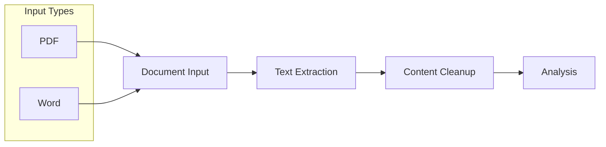
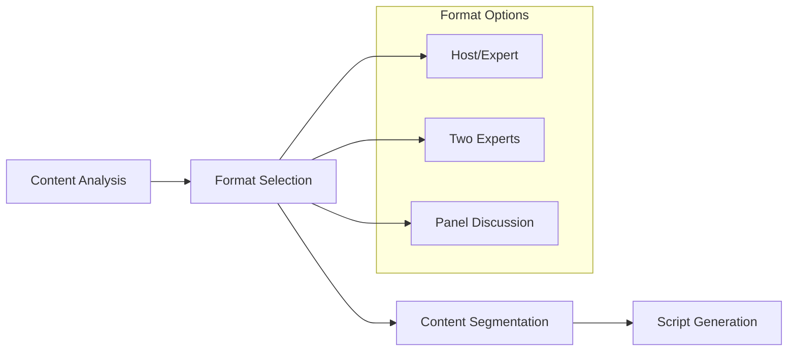
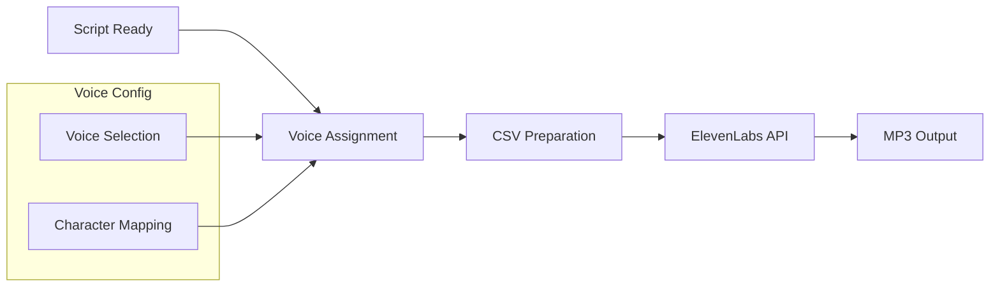
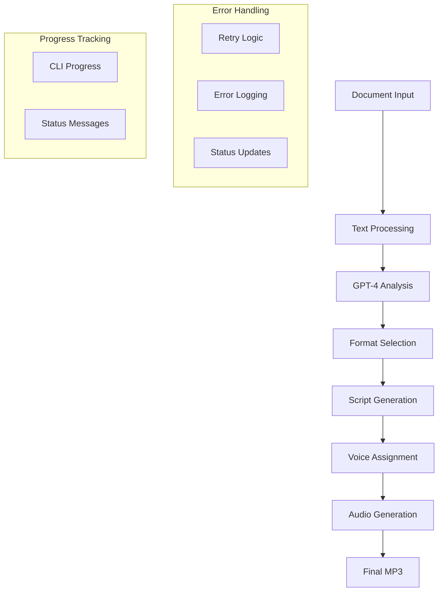
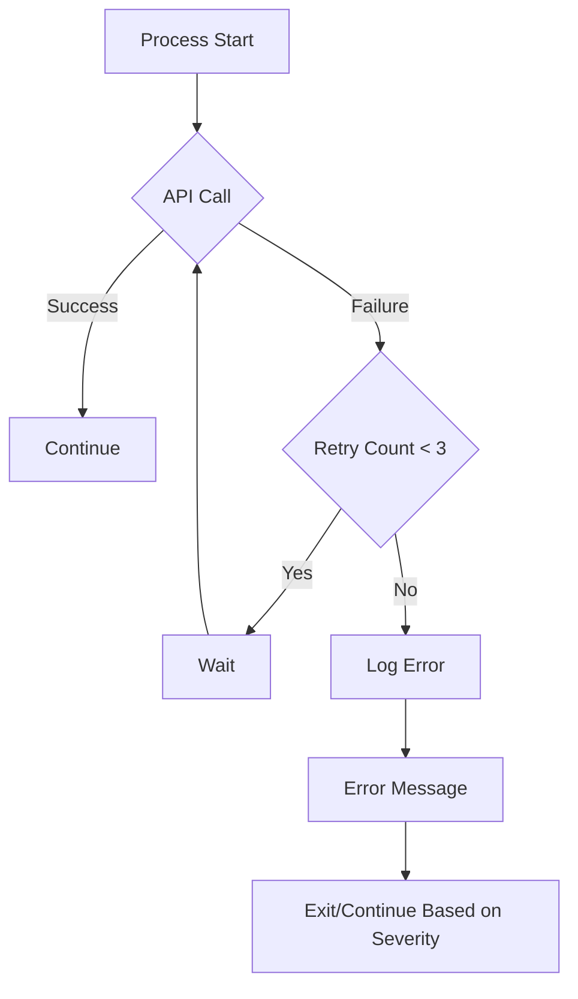

# MASTERPLAN.md

## 1. App Overview and Objectives
Text2Pod is a standalone Python CLI application that converts consulting knowledge documents into engaging podcast-style audio content through automated workflow.

### Primary Objectives:
- Convert PDF/Word documents into natural dialogue scripts
- Generate professional audio using ElevenLabs voices
- Maintain content integrity while making it engaging
- Provide user control over format and technical depth
- Ensure reliable processing with proper error handling

## 2. Technical Stack & Project Structure

### Core Technologies:
- Python 3.x
- OpenAI GPT-4 API Model: `gpt-4o-mini`
- ElevenLabs API
- Document Processing: PyPDF2, python-docx
- Environment Management: python-dotenv
- Progress Tracking: tqdm
- Error Handling: logging

### Project Structure:
```plaintext
text2pod/
├── src/
│   ├── cli.py              # Main entry point
│   ├── document_processor.py
│   ├── script_generator.py
│   ├── audio_generator.py
│   └── utils/
│       ├── config.py       # Configuration management
│       ├── error_handler.py
│       └── progress.py
├── tests/
│   ├── test_document_processor.py
│   ├── test_script_generator.py
│   ├── test_audio_generator.py
│   └── test_files/
│       └── sample.pdf
├── input/                  # Document input directory
├── output/                # Generated audio output
├── .env                   # Environment configuration
└── requirements.txt       # Project dependencies
```

### Running the Application:
```bash
# From project root
python src/cli.py input/document.pdf [options]
```

## 3. Workflow Architecture

### 3.1 Document Processing Module


### 3.2 Script Generation Module


### 3.3 Audio Generation Module


### 3.4 Complete Process Flow


### 3.5 Error Handling Flow


## 4. Implementation Details

### 4.1 Configuration Management
```plaintext
.env
├── OPENAI_API_KEY
├── ELEVENLABS_API_KEY
└── VOICE_CONFIGS
```

### 4.2 Error Handling Strategy
- Comprehensive logging
- Graceful failure handling
- Automatic retries for API calls
- Transaction-like processing for segments

### 4.3 Progress Tracking
- CLI progress bars for each stage
- Status updates for long-running processes
- Error reporting and recovery options

## 5. CLI Interface Design
```plaintext
Usage: python src/cli.py [options] input_file

Options:
  --format        Override suggested format
  --technical-depth {low,medium,high}
  --target-duration MINUTES
  --regenerate-segment SEGMENT_ID
```

## 6. Processing Phases

### Phase 1: Document Input
- [ ] File validation
- [ ] Format detection
- [ ] Content extraction
- Progress: 10%

### Phase 2: Content Analysis
- [ ] Document structure analysis
- [ ] Topic identification
- [ ] Format suggestion
- Progress: 25%

### Phase 3: Script Generation
- [ ] Segment planning
- [ ] Dialogue generation
- [ ] Review opportunities
- Progress: 50%

### Phase 4: Voice Processing
- [ ] Voice assignment
- [ ] CSV preparation
- Progress: 75%

### Phase 5: Audio Generation
- [ ] ElevenLabs processing
- [ ] MP3 compilation
- Progress: 100%

## 7. Error Handling and Logging

### 7.1 Logging Levels
- [ ] INFO: General progress
- [ ] WARNING: Non-critical issues
- [ ] ERROR: Critical issues
- [ ] DEBUG: Development details

### 7.2 Error Recovery
- [ ] Automatic retry for API calls (max 3 attempts)
- [ ] Segment-level failure isolation
- [ ] State preservation for long processes

## 8. Future Expansion Possibilities
- [ ] Web-based interface
- [ ] Multi-user support
- [ ] Audio post-processing
- [ ] Custom voice training
- [ ] Script template library
- [ ] Batch processing

## 9. Security Considerations
- [ ] Secure API key storage
- [ ] Content validation
- [ ] Rate limiting compliance
- [ ] Error message sanitization

## 10. Performance Optimization
- [ ] Chunked processing
- [ ] Parallel processing where applicable
- [ ] Resource management
- [ ] Cache management

## 11. Development Phases

### MVP Phase (Current)
- [ ] Basic document processing
- [ ] Script generation
- [ ] ElevenLabs integration
- [ ] CLI interface
- [ ] Progress tracking
- [ ] Basic error handling

### Future Phases
- [ ] Enhanced error recovery
- [ ] Web interface
- [ ] Advanced audio processing
- [ ] Template management
- [ ] Batch processing
- [ ] Analytics

## 12. Testing Strategy
- [ ] Unit tests for each module
- [ ] Integration tests for API calls
- [ ] End-to-end workflow testing
- [ ] Error condition testing

## 13. Project Structure
```plaintext
text2pod/
├── src/
│   ├── cli.py              # Main entry point
│   ├── document_processor.py
│   ├── script_generator.py
│   ├── audio_generator.py
│   └── utils/
│       ├── config.py       # Configuration management
│       ├── error_handler.py
│       └── progress.py
├── tests/
│   ├── test_document_processor.py
│   ├── test_script_generator.py
│   ├── test_audio_generator.py
│   └── test_files/
│       └── sample.pdf
├── input/                  # Document input directory
├── output/                # Generated audio output
├── .env                   # Environment configuration
└── requirements.txt       # Project dependencies
```

## 14. Getting Started
1. Clone repository
2. Create virtual environment: `python -m venv venv`
3. Activate environment: `source venv/bin/activate`
4. Install dependencies: `pip install -r requirements.txt`
5. Create .env file with API keys
6. Run: `python src/cli.py input/document.pdf`

## 15. Contributing Guidelines
- Code style: PEP 8
- Documentation: Google style docstrings
- Testing: pytest
- Branch naming: feature/, bugfix/, hotfix/
- Commit messages: Conventional Commits

## Development Workflow
1. Start with document processing (PDF support first)
2. Implement script generation
3. Add audio generation
4. Enhance with error handling and progress tracking
5. Add configuration options and CLI parameters

## Testing Strategy
1. Create test files in tests/test_files/
2. Run tests using pytest
3. Manual CLI testing with sample documents
4. Error condition testing

## Getting Started
1. Clone repository
2. Create virtual environment: `python -m venv venv`
3. Activate environment: `source venv/bin/activate`
4. Install dependencies: `pip install -r requirements.txt`
5. Create .env file with API keys
6. Run: `python src/cli.py input/document.pdf`
