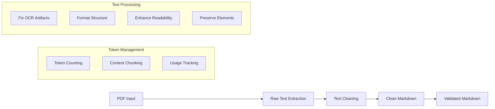
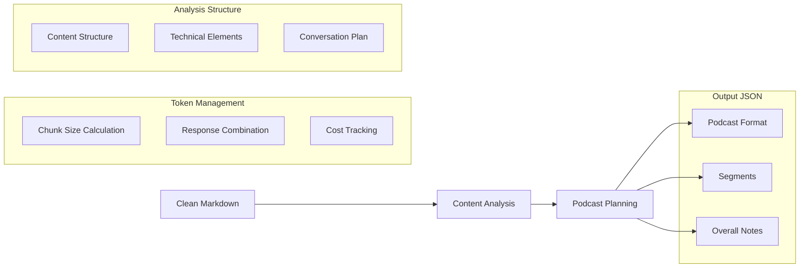
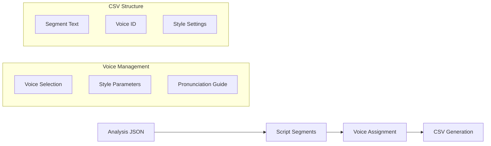

# MASTERPLAN.md

## 1. App Overview and Objectives
Text2Pod is a standalone Python CLI application that converts consulting knowledge documents into engaging podcast-style audio content through automated workflow.

### Primary Objectives:
- Convert PDF/Word documents into natural dialogue scripts
- Generate professional audio using ElevenLabs voices
- Maintain content integrity while making it engaging
- Provide user control over format and technical depth
- Ensure reliable processing with proper error handling

## 2. Technical Stack & Project Structure

### Core Technologies:
- Python 3.x
- OpenAI GPT-4 API Model: `gpt-4o-mini`
- ElevenLabs API
- Document Processing: PyPDF2, python-docx
- Environment Management: python-dotenv
- Progress Tracking: tqdm with enhanced formatting
- Error Handling: logging
- Token Management: tiktoken
- Table Formatting: tabulate

### Project Structure:
```plaintext
text2pod/
├── src/
│   ├── cli.py              # Main entry point
│   ├── document_processor.py
│   ├── script_generator.py
│   ├── audio_generator.py
│   └── utils/
│       ├── config.py       # Configuration management
│       ├── error_handler.py
│       ├── token_manager.py # Token counting and chunking
│       ├── openai_client.py # OpenAI API interactions
│       ├── content_analyzer.py # Content analysis
│       ├── interactive.py   # Interactive mode utilities
│       └── progress.py     # Progress tracking
├── tests/
│   ├── test_document_processor.py
│   ├── test_script_generator.py
│   ├── test_audio_generator.py
│   └── test_files/
│       └── sample.pdf
├── input/                  # Document input directory
├── output/                # Generated audio output
├── .env                   # Environment configuration
└── requirements.txt       # Project dependencies
```

### Running the Application:
```bash
# From project root
python src/cli.py input/document.pdf [options]
```

## 3. Workflow Architecture

### 3.1 Document Processing Module


### 3.2 Content Analysis Module


### 3.3 Processing Pipeline Stages

1. Document Processing
    - Extract raw text from PDF
    - Clean and normalize text
    - Convert to structured markdown
    - Validate markdown output

2. Content Analysis
    - Analyze markdown content
    - Plan podcast structure
    - Generate segment breakdown
    - Create technical glossary

3. Output Generation
    - Save clean markdown content
    - Save structured analysis JSON
    - Generate podcast script (next phase)
    - Create audio content (next phase)

## 4. Token Management

### Token Limits
- Maximum context: 128,000 tokens
- Safety margin: 10% buffer
- System prompt reserve: 1,000 tokens
- Response reserve: 4,000 tokens

### Response Formats
- Text mode: Clean markdown output
- JSON mode: Structured analysis data

### Content Types
1. Markdown Content
    - Proper heading hierarchy
    - Formatted lists and tables
    - Code blocks with language tags
    - Preserved technical terms

2. Analysis Structure
    - Podcast format recommendation
    - Segmented content plan
    - Technical term definitions
    - Discussion questions
    - Duration estimates

## 5. Error Handling

### Error Types:
- DocumentProcessingError
- APIError
- ContentAnalysisError
- TokenError
- UserCancelled

### Recovery Strategies:
- Automatic retry with delay
- Chunk size adjustment
- Response validation
- Fallback options
- Interactive continuation options

## 6. Configuration

### Environment Variables:
```plaintext
OPENAI_API_KEY=your_key
ELEVENLABS_API_KEY=your_key
OPENAI_MODEL=gpt-4o-mini
MAX_SEGMENT_LENGTH=5000
MAX_RETRIES=3
RETRY_DELAY=1
MAX_TOKENS=128000
CHUNK_SIZE=100000
```

### CLI Options:
```plaintext
--debug         Enable debug logging
--interactive   Enable interactive mode
--format        Override script format
```

## 7. Voice Processing

### 7.1 Voice Processing Flow


### 7.2 ElevenLabs Integration
- Voice Selection
    - Host voice for narration
    - Expert voices for technical content
    - Panel voices for discussions

- Voice Parameters
    - Stability: 0.5 (balanced)
    - Clarity: 0.8 (high for technical content)
    - Style: 0.3 (natural conversation)

- CSV Format
```csv
segment_id,voice_id,text,stability,clarity,style
intro_001,host_voice,"Welcome to...",0.5,0.8,0.3
expert_001,expert_voice,"The technical aspect...",0.6,0.9,0.2
```
